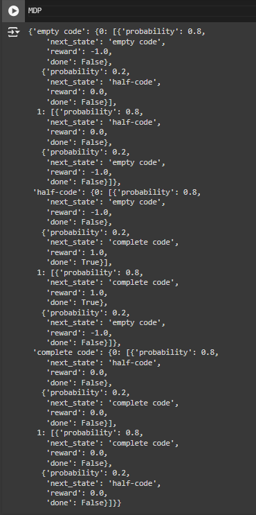

# MDP REPRESENTATION
## AIM:
The aim of this MDP is to model the decision-making process of a person while coding, considering two levels of concentration - full concentration and half concentration, and to maximize productivity.

## PROBLEM STATEMENT:
### Problem Description
In this scenario, we want to model a person's coding process. The person can be in one of four states: "empty code," "half-code," "complete code," and "done." They can take two actions: "coding with full concentration" and "coding with half concentration." The goal is to maximize the productivity of the person.

## State Space:
- "empty code": The person has not started coding.
- "half-code": The person is coding with half concentration.
- "complete code": The person has completed coding with full concentration.
- "done": The task is completed.

## Sample State:
A sample state could be "empty code," indicating that the person has not started coding yet.

## Action Space:
- "coding with full concentration": The person codes with full concentration.
- "coding with half concentration": The person codes with half concentration.

## Sample Action:
A sample action could be "coding with full concentration," indicating that the person is coding with full concentration.

## Reward Function:
- Transition to the same state has a reward of 0.0.
- Transition to the "complete code" state with "coding with half concentration" action has a reward of 1.0, indicating productivity.
- Transition to the "empty code" state with any action has a reward of -1.0, indicating time wasted.

## Graphical Representation:


# Python Representation
```python
MDP = {
    "empty code": {
        0: [
            {"probability": 0.8, "next_state": "empty code", "reward": -1.0, "done": False},
            {"probability": 0.2, "next_state": "half-code", "reward": 0.0, "done": False},
        ],
        1: [
            {"probability": 0.8, "next_state": "half-code", "reward": 0.0, "done": False},
            {"probability": 0.2, "next_state": "empty code", "reward": -1.0, "done": False},
        ],
    },
    "half-code": {
        0: [
            {"probability": 0.8, "next_state": "empty code", "reward": -1.0, "done": False},
            {"probability": 0.2, "next_state": "complete code", "reward": 1.0, "done": True},
        ],
        1: [
            {"probability": 0.8, "next_state": "complete code", "reward": 1.0, "done": True},
            {"probability": 0.2, "next_state": "empty code", "reward": -1.0, "done": False},
        ],
    },
    "complete code": {
        0: [
            {"probability": 0.8, "next_state": "half-code", "reward": 0.0, "done": False},
            {"probability": 0.2, "next_state": "complete code", "reward": 0.0, "done": False},
        ],
        1: [
            {"probability": 0.8, "next_state": "complete code", "reward": 0.0, "done": False},
            {"probability": 0.2, "next_state": "half-code", "reward": 0.0, "done": False},
        ],
    }
}
```
## OUTPUT:



## RESULT:
The result of solving this MDP would be an optimal policy that tells the person which action to take in each state to maximize their productivity while coding.
